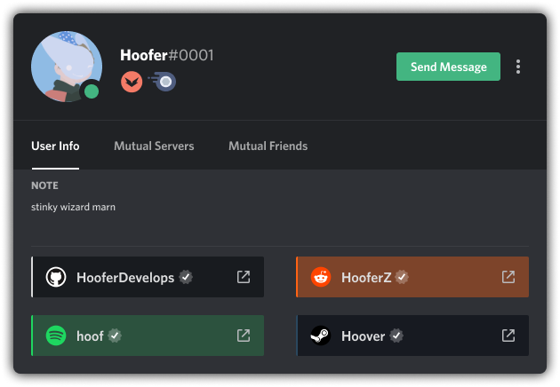

# Refined User Connections
Adds a bit of a boom-shaka-laka to those user connections.



## Installation
For **[Powercord](http://powercord.dev/)** or **[Vizality](https://vizality.com/)** installation, **locate and head over to your themes folder, open a terminal of choice, and enter the following:**
```
git clone https://github.com/Discord-Theme-Addons/refined-user-connections
```

**For [BetterDiscord](http://betterdiscord.app/):**
- [Direct Download](https://github.com/Discord-Theme-Addons/refined-user-connections/releases/download/1.3.1/RefinedUserConections.theme.css)
- [View Source](https://discord-theme-addons.github.io/gradientbuttons-v2/src/support/compiled.css)

**For [Stylus](https://github.com/openstyles/stylus):**
1. Install the Stylus extension for [Chrome](https://chrome.google.com/webstore/detail/stylus/clngdbkpkpeebahjckkjfobafhncgmne) / [Firefox](https://addons.mozilla.org/en-US/firefox/addon/styl-us/) / [Opera](https://github.com/openstyles/stylus/wiki/Opera,-Outdated-Stylus).
2. After installing, head over to [this link](https://discord-theme-addons.github.io/refined-user-connections/src/support/GradientButtons.user.css).
3. Press the "Install Style" button.

# Credits
A big thank you and shout-out to everyone who helped with this!
- **[Hoofer](https://github.com/HooferDevelops)** for helping me figure out why it wasn't applying to the connections properly.
- **[Tropical](https://github.com/Tropix126)** for helping me improve the code by giving me a well needed lecture.
- **[snapper](https://github.com/snappercord/)** for the inspiration of rewriting all my themes READMEs.
- **[Cynthia](https://github.com/cyyynthia)** for helping me find a user who has a facebook connection, **[Nyria](https://github.com/NYRI4)** for helping me find a user who has a League of Legends connection, and **[Ben855](https://github.com/BenSegal855)** for finding me a user who has a Skype connection

"ayaya" -novalfuzzy