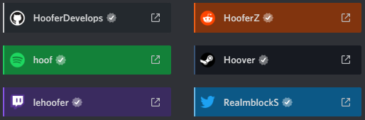

<p align="center">
      <a href="#">
  <a href="#">
  <a href="https://github.com/LuckFire/Nicer-User-Connections/stargazers"></a>
</p>

# Nicer User Connections
Adds a bit of a boom-shaka-laka to those user connections.



# Installation 
Let's be real here, you want cooler connections, just admit it. For Powercord or Vizality installation, go to **Themes -> Open a CMD / Powershell / Terminal / Gitbash** in the folder, and enter the following:
```
git clone https://github.com/LuckFire/Nicer-User-Connections
```

**For BetterDiscord**:
- [Direct Download](https://betterdiscord.net/ghdl?id=3479)
- [View Source](https://raw.githack.com/LuckFire/Nicer-User-Connections/main/src/NicerUserConections.theme.css)

**For Browser / Web:**
1. Install the Stylus extension for [Chrome](https://chrome.google.com/webstore/detail/stylus/clngdbkpkpeebahjckkjfobafhncgmne) / [Firefox](https://addons.mozilla.org/en-US/firefox/addon/styl-us/) / [Opera](https://github.com/openstyles/stylus/wiki/Opera,-Outdated-Stylus).
2. After installing, head over to [this link](https://raw.githack.com/LuckFire/Nicer-User-Connections/main/src/NicerUserConections.user.css).
3. Press the "Install Style" button.

# Updating for Powercord
Since Powercord's updater is currently broken, you have to update the theme manually. In order to do this, go to **Themes -> Nicer-User-Connections -> Open a CMD / Powershell / Terminal / Gitbash** in the folder, and enter the following:
```
git pull
```

# Credits
Ty to [@Hoofer](https://github.com/HooferDevelops) for reminding me that im a dumbass and did dumbass things, but it made me grow a brain in the process <3

Ty to [@Cynthia](https://github.com/cyyynthia) for finding me a user who has a facebook connection, ty [@Nyria](https://github.com/NYRI4) for finding me a user who has a LoL (League of Legends) connection, and ty to [@Ben855](https://github.com/BenSegal855) for finding me a user who has a Skype connection <3

Ty to [@Tropical](https://github.com/Tropix126) for giving me the big brain knowledge to better improve my code <3

big pog thank you to [@snapper](https://github.com/snappercord/) for all of the inspiration with me rewriting every repo i have basically!!!1