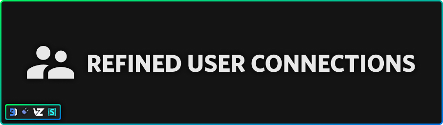

# Downloads
### **[Powercord](https://powercord.dev/) & [Vizality](https://vizality.com/)**
Head over to your **Themes folder -> open your terminal of choice -> copy-paste the following, then press enter**:
```
git clone https://github.com/discord-extensions/modern-user-connections
```

### **[BetterDiscord](https://betterdiscord.app/)**
- [Direct Download](https://github.com/discord-extensions/modern-user-connections/releases/download/betterdiscord/modern-user-connections.theme.css)
- [Source](https://discord-extensions.github.io/modern-user-connections/src/source.css)

### **Stylus**
1. Install the browser extension for your respective browser.
    - [Chrome Webstore](https://chrome.google.com/webstore/detail/stylus/clngdbkpkpeebahjckkjfobafhncgmne)
    - [Firefox Addons](https://addons.mozilla.org/en-US/firefox/addon/styl-us/)
2. Once you have the browser extension, head over to [this link](https://github.com/discord-extensions/modern-user-connections/raw/main/clients/stylus/modern-user-connections.user.css). It will open a new window to the page to install the style.
3. Press the "Install Style" button.

# Contributors
|<a href="https://github.com/HooferDevelops"></a>|<a href="https://github.com/Tropix126"></a>|<a href="https://github.com/Snapperito"></a>|<a href="https://github.com/cyyynthia"></a>|<a href="https://github.com/NYRI4"></a>|<a href="https://github.com/BenSegal855"></a>|<a href="https://github.com/NYRI4"></a>|<a href="https://github.com/Piggered"></a>|
|:-:|:-:|:-:|:-:|:-:|:-:|:-:|
|[HooferDevelops](https://github.com/HooferDevelops)|[Tropix126](https://github.com/Tropix126)|[Snapperito](https://github.com/Snapperito)|[Cynthia](https://github.com/cyyynthia)|[NYRI4](https://github.com/NYRI4)|[BenSegal855](https://github.com/BenSegal855)|[Piggered](https://github.com/Piggered)|

# Support Server
If you are having any issues with the theme, feel free to join the [support server](https://discord.gg/vYdXbEzqDs), or make an issue on this repository.